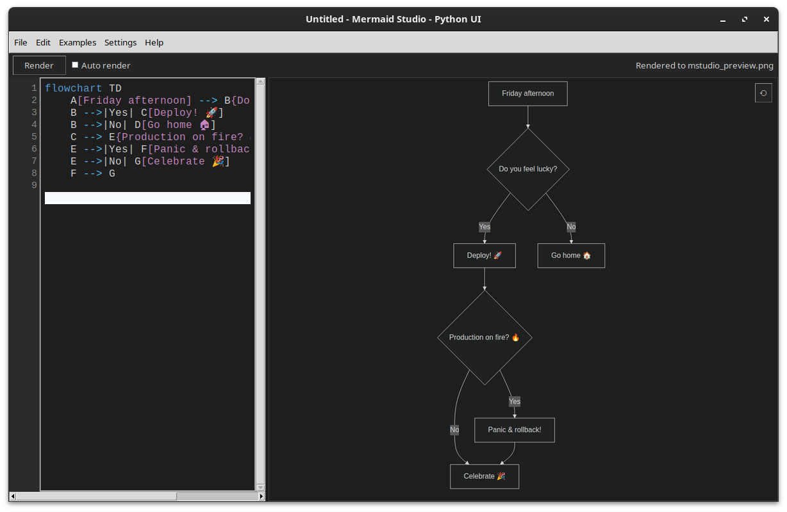

# Mermaid Studio (Python UI)

A lightweight desktop GUI for **Mermaid diagrams**, built with **Python + Tkinter**.  
It provides a simple two-pane interface: a text editor on the left for Mermaid code and a live rendered preview on the right.  

Mermaid Studio is designed to be **fast, offline-friendly, and minimal** — a native alternative to browser or Electron-based editors.

*Main window with default light theme and an example.*

---

## ✨ Features

- **Write and edit Mermaid code** for flowcharts, sequence diagrams, Gantt charts, ER diagrams, and more.
- **Instant PNG rendering** via [mermaid-cli](https://github.com/mermaid-js/mermaid-cli).
- **Auto-render mode** with adjustable delay.
- **Light and Dark UI themes** with synchronized preview backgrounds.
- **Selectable Mermaid diagram theme** (Default, Forest, Dark, Neutral).
- **Optional “Sketch” mode** for a hand-drawn look when supported.
- **Save prompt before exit** if unsaved edits are detected.
- **Recent file history** under *File → Recent*.
- **Error highlighting** and inline log viewer for Mermaid parser messages.
- **Zoomable and pannable preview pane** with reset-to-fit button.
- **Configurable mmdc path** and Puppeteer Chrome binary.
- **Lightweight** — pure Python + Pillow, no Electron or webserver.

---

## 🧩 Requirements

- Python 3.10+
- Node.js + npm (for installing mermaid-cli)
- A working Chrome or Chromium browser binary (for Puppeteer)
- Pillow Python library (pip install pillow)

---

## ⚙️ Installation

1. Clone the repository

   git clone https://github.com/<yourusername>/mermaid-studio.git  
   cd mermaid-studio

2. Install dependencies

   sudo apt install python3-tk python3-pil python3-pil.imagetk nodejs npm -y  
   pip install pillow

3. Install mermaid-cli globally

   sudo npm install -g @mermaid-js/mermaid-cli

4. Install Chrome for Puppeteer

   npx --yes puppeteer@latest browsers install chrome

5. Create Puppeteer config file

   npx --yes puppeteer@latest browsers install chrome
   CHROME="$(ls -d ~/.cache/puppeteer/chrome/*/chrome-linux64/chrome | tail -n1)"
   mkdir -p ~/.config/mermaid_studio
   cat > ~/.config/mermaid_studio/puppeteer.json <<EOF
   {
   "executablePath": "$CHROME",
   "args": ["--no-sandbox", "--disable-setuid-sandbox"]
   }
   EOF

---

## ▶️ Running

   python3 mermaid_studio.py

When launched, you can:
- Edit Mermaid code in the left pane.
- Click **Render** to generate a PNG preview.
- Use **Auto render** for live updates.
- Switch **UI theme** (Light/Dark) and **Mermaid diagram theme** from *Settings*.
- Toggle **Sketch mode** to enable a hand-drawn style.
- Use *File → Export PNG As…* to save rendered diagrams.

  
*Dark mode with Dark Mermaid theme.*

---

## 💾 File Handling and Temporary Cache

- Temporary files are stored under  
  `~/.mermaid_studio_cache/`  
  (hidden by default to keep your home directory tidy).

- Old PNGs are automatically removed between renders to avoid clutter.

- Mermaid Studio prompts to **save before exit** if edits are unsaved.

---

## 🧠 Troubleshooting

If rendering doesn’t work:

- Ensure **Settings → Set mmdc path...** points to your actual `mmdc` binary (e.g. `/usr/local/bin/mmdc`).
- Check your Puppeteer config at  
  `~/.config/mermaid_studio/puppeteer.json`  
  references a valid Chrome path.
- Test that `mmdc` runs in a terminal.
- Temporary `.mmd` source files appear in `~/.mermaid_studio_cache/` for inspection.

---

## 🖼️ Exporting Diagrams

Mermaid Studio currently supports **PNG export** only.

When you click **Render**, `mmdc` generates a PNG preview.  
**Export PNG As…** simply copies that rendered image — ensuring exports always match your current preview.

Advantages:
- ✅ Instant exports (no extra rendering step)
- ✅ Error-safe (only successful diagrams can be exported)
- ✅ Portable (PNG works everywhere)

---

## 🧱 Building a Standalone App (PyInstaller)

You can package Mermaid Studio into a single self-contained binary for Linux using PyInstaller.

1. Ensure build tools are installed:

   sudo apt install python3-venv python3-pip -y  
   pip install pyinstaller pillow

2. Run the included build script:

   chmod +x build.sh  
   ./build.sh

3. The resulting binary will be created at:

   dist/MermaidStudio

4. Notes:
   - The app still relies on your system mermaid-cli (mmdc).  
   - Ensure `@mermaid-js/mermaid-cli` is installed globally and works from the terminal.  
   - If your setup uses a Puppeteer config file, keep it at:  
     ~/.config/mermaid_studio/puppeteer.json  
   - Example config content:  
     {  
       "executablePath": "/full/path/to/chrome",  
       "args": ["--no-sandbox", "--disable-setuid-sandbox"]  
     }

---

## 🪶 License

MIT License © 2025

Mermaid Studio is an independent open-source project that uses the Mermaid.js diagramming engine. It is not affiliated with or endorsed by the Mermaid.js team.

---

## 💡 Acknowledgements

- Mermaid.js (https://mermaid.js.org/)  
- @mermaid-js/mermaid-cli (https://github.com/mermaid-js/mermaid-cli)  
- Tkinter (Python standard GUI)
- Pillow (image handling for preview rendering)
